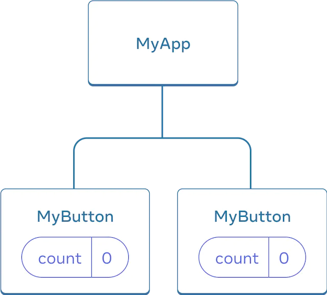
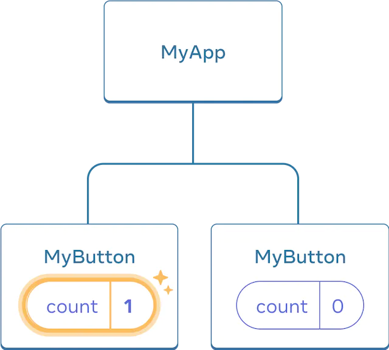
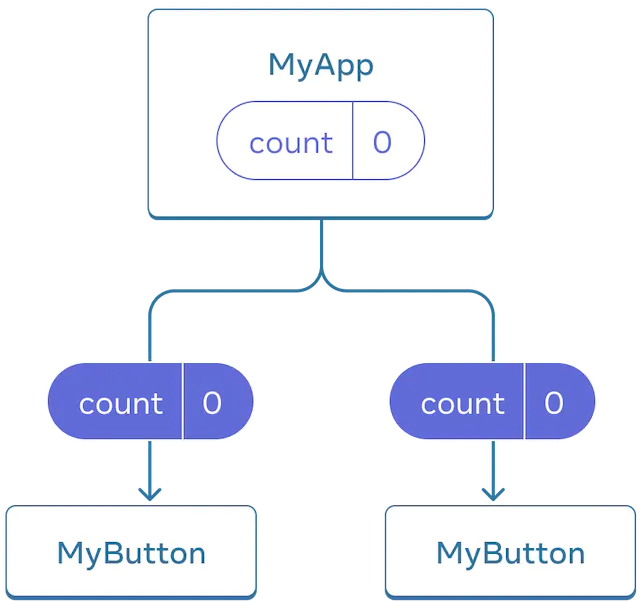

# Learn_React
[Learn React](https://react.dev/learn) - https://react.dev/learn

## Overview

This page will give you an introduction to the 80% of React concepts that you will use on a daily basis.

You will learn
* How to create and nest components
* How to add markup and styles
* How to display data
* How to render conditions and lists
* How to respond to events and update the screen
* How to share data between components

## Creating and nesting components

React apps are made out of components. A component is a piece of the UI (user interface) that has its own logic and appearance. 

```
function MyButton() {
  return (
    <button>I'm a button</button>
  );
}
```

Now that you’ve declared MyButton, you can nest it into another component:

```
export default function MyApp() {
    return (
        <div>
            <h1>Welcome to my app</h1>
            <MyButton />
        </div>
    ) ;
}
```

The result:

```
function MyButton() {
    return (
      <button>
        I'm a button
      </button>
    );
  }
  
export default function MyApp() {
    return (
        <div>
        <h1>Welcome to my app</h1>
        <MyButton />
        </div>
    );
}
```
## Writing markup with JSX

JSX is stricter than HTML. You have to close tags like &lt;br /&gt;. Your component also can’t return multiple JSX tags. You have to wrap them into a shared parent, like a <div>...</div> or an empty <>...</> wrapper:

```
function AboutPage() {
    return (
        <>
            <h1>About</h1>
            <p>Hello there. <br />How do you do?</p>
        </>
    )
}
```

Then you write the CSS rules for it in a separate CSS file:

```
.avatar {
  border-radius: 50%;
}
```

React does not prescribe how you add CSS files. In the simplest case, you’ll add a <link> tag to your HTML. 

## Adding styles

In React, you specify a CSS class with className. It works the same way as the HTML class attribute:

```

```

## Displaying data

JSX lets you put markup into JavaScript. Curly braces let you “escape back” into JavaScript so that you can embed some variable from your code and display it to the user. For example, this will display user.name:

```
return (
  <h1>
    {user.name}
  </h1>
);
```

You can also “escape into JavaScript” from JSX attributes, but you have to use curly braces _instead_ of quotes. 

```
return (
  
);
```

You can put more complex expressions inside the JSX curly braces too, for example, string concatenation:

```
const user = {
  name: 'Hedy Lamarr',
  imageUrl: 'https://i.imgur.com/yXOvdOSs.jpg',
  imageSize: 90,
};

export default function Profile() {
  return (
    <>
      <h1>{user.name}</h1>
      
    </>
  );
}

```

In the above example, style={{}} is not a special syntax, but a regular {} object inside the style={ } JSX curly braces. You can use the style attribute when your styles depend on JavaScript variables.

## Conditional rendering

In React, there is no special syntax for writing conditions. Instead, you’ll use the same techniques as you use when writing regular JavaScript code. For example, you can use an if statement to conditionally include JSX:

```
let content;
if (isLoggedIn) {
  content = <AdminPanel />;
} else {
  content = <LoginForm />;
}
return (
  <div>
    {content}
  </div>
);
```

If you prefer more compact code, you can use the conditional ? operator. Unlike if, it works inside JSX:

```
<div>
  {isLoggedIn ? (
    <AdminPanel />
  ) : (
    <LoginForm />
  )}
</div>
```

When you don’t need the else branch, you can also use a shorter logical && syntax:

```
<div>
  {isLoggedIn && <AdminPanel />}
</div>
```


## Rendering lists

You will rely on JavaScript features like for loop and the array map() function to render lists of components.

For example, let’s say you have an array of products:

```
const products = [
  { title: 'Cabbage', id: 1 },
  { title: 'Garlic', id: 2 },
  { title: 'Apple', id: 3 },
];
```

Inside your component, use the map() function to transform an array of products into an array of <li> items:

```
    const listItems = products.map(product =>
    <li key={product.id}>
        {product.title}
    </li>
    );

    return (
    <ul>{listItems}</ul>
    );
```

Notice how <li> has a key attribute. For each item in a list, you should pass a string or a number that uniquely identifies that item among its siblings. Usually, a key should be coming from your data, such as a database ID. React uses your keys to know what happened if you later insert, delete, or reorder the items.

```
const products = [
    { title: 'Cabbage', isFruit: false, id: 1 },
    { title: 'Garlic', isFruit: false, id: 2 },
    { title: 'Apple', isFruit: true, id: 3 },
  ];
  
  export default function ShoppingList() {
    const listItems = products.map(product =>
      <li
        key={product.id}
        style={{
          color: product.isFruit ? 'magenta' : 'darkgreen'
        }}
      >
        {product.title}
      </li>
    );
  
    return (
      <ul>{listItems}</ul>
    );
  }
```
## Responding to events

You can respond to events by declaring event handler functions inside your components:

```
function MyButton() {
  function handleClick() {
    alert('You clicked me!');
  }

  return (
    <button onClick={handleClick}>
      Click me
    </button>
  );
}
```
Notice how onClick={handleClick} has no parentheses at the end! Do not call the event handler function: you only need to pass it down. React will call your event handler when the user clicks the button.

## Updating the screen

Often, you’ll want your component to “remember” some information and display it. For example, maybe you want to count the number of times a button is clicked. To do this, add state to your component.

First, import useState from React:

```
import { useState } from 'react';
```
Now you can declare a state variable inside your component:
```
function MyButton() {
  const [count, setCount] = useState(0);
  // ...
```

You’ll get two things from useState: the current state (count), and the function that lets you update it (setCount). You can give them any names, but the convention is to write [something, setSomething].

The first time the button is displayed, count will be 0 because you passed 0 to useState(). When you want to change state, call setCount() and pass the new value to it. Clicking this button will increment the counter:

```
function MyButton() {
  const [count, setCount] = useState(0);

  function handleClick() {
    setCount(count + 1);
  }

  return (
    <button onClick={handleClick}>
      Clicked {count} times
    </button>
  );
}
```

React will call your component function again. This time, count will be 1. Then it will be 2. And so on.

If you render the same component multiple times, each will get its own state. Click each button separately:

```
import { useState } from 'react';

export default function MyApp() {
  return (
    <div>
      <h1>Counters that update separately</h1>
      <MyButton />
      <MyButton />
    </div>
  );
}

function MyButton() {
  const [count, setCount] = useState(0);

  function handleClick() {
    setCount(count + 1);
  }

  return (
    <button onClick={handleClick}>
      Clicked {count} times
    </button>
  );
}
```

Notice how each button “remembers” its own count state and doesn’t affect other buttons.

## Using Hooks

Functions starting with use are called Hooks. useState is a built-in Hook provided by React. You can find other built-in Hooks in the [API reference](https://react.dev/reference/react). You can also write your own Hooks by combining the existing ones.

Hooks are more restrictive than other functions. You can only call Hooks at the top of your components (or other Hooks). If you want to use useState in a condition or a loop, extract a new component and put it there.


## Sharing data between components

In the previous example, each MyButton had its own independent count, and when each button was clicked, only the count for the button clicked changed:

  

However, often you’ll need components to share data and always update together.

To make both MyButton components display the same count and update together, you need to move the state from the individual buttons “upwards” to the closest component containing all of them.

In this example, it is MyApp:

  

Now when you click either button, the count in MyApp will change, which will change both of the counts in MyButton. Here’s how you can express this in code.

First, move the state up from MyButton into MyApp:

```
export default function MyApp() {
  const [count, setCount] = useState(0);

  function handleClick() {
    setCount(count + 1);
  }

  return (
    <div>
      <h1>Counters that update separately</h1>
      <MyButton />
      <MyButton />
    </div>
  );
}

function MyButton() {
  // ... we're moving code from here ...
}
```

Then, pass the state down from MyApp to each MyButton, together with the shared click handler. You can pass information to MyButton using the JSX curly braces, just like you previously did with built-in tags like :

```
export default function MyApp() {
  const [count, setCount] = useState(0);

  function handleClick() {
    setCount(count + 1);
  }

  return (
    <div>
      <h1>Counters that update together</h1>
      <MyButton count={count} onClick={handleClick} />
      <MyButton count={count} onClick={handleClick} />
    </div>
  );
}
```

The information you pass down like this is called props. Now the MyApp component contains the count state and the handleClick event handler, and passes both of them down as props to each of the buttons.

Finally, change MyButton to read the props you have passed from its parent component:

```
function MyButton({ count, onClick }) {
  return (
    <button onClick={onClick}>
      Clicked {count} times
    </button>
  );
}
```
When you click the button, the onClick handler fires. Each button’s onClick prop was set to the handleClick function inside MyApp, so the code inside of it runs. That code calls setCount(count + 1), incrementing the count state variable. The new count value is passed as a prop to each button, so they all show the new value. This is called “lifting state up”. By moving state up, you’ve shared it between components.

```
import { useState } from 'react';

export default function MyApp() {
  const [count, setCount] = useState(0);

  function handleClick() {
    setCount(count + 1);
  }

  return (
    <div>
      <h1>Counters that update together</h1>
      <MyButton count={count} onClick={handleClick} />
      <MyButton count={count} onClick={handleClick} />
    </div>
  );
}
```
## Next Steps

By now, you know the basics of how to write React code!

Check out the [Tutorial](https://react.dev/learn/tutorial-tic-tac-toe) to put them into practice and build your first mini-app with React.

# Tuorial: Tic-Tac-Toe

The tutorial is divided into several sections:

* Setup for the tutorial will give you a starting point to follow the tutorial.
* Overview will teach you the fundamentals of React: components, props, and state.
* Completing the game will teach you the most common techniques in React development.
* Adding time travel will give you a deeper insight into the unique strengths of React.

## Overview
### What are you building?

In this tutorial, you’ll build an interactive tic-tac-toe game with React.

## Setup for the tutorial

In the live code editor below, click Fork in the top-right corner to open the editor in a new tab using the website CodeSandbox. CodeSandbox lets you write code in your browser and preview how your users will see the app you’ve created. The new tab should display an empty square and the starter code for this tutorial.

[Code Sandbox](https://codesandbox.io/s/vy6j3f?file=%2FApp.js&utm_medium=sandpack)

## Overview

### Inspecting the starter code

In CodeSandbox you’ll see three main sections:

1. The Files section with a list of files like App.js, index.js, styles.css and a folder called public
1. The code editor where you’ll see the source code of your selected file
1. The browser section where you’ll see how the code you’ve written will be displayed

The App.js file should be selected in the Files section. The contents of that file in the code editor should be:

```
export default function Square() {
  return <button className="square">X</button>;
}
```

styles.css

index.js

```
import React, { StrictMode } from "react";
import { createRoot } from "react-dom/client";
import "./styles.css";

import App from "./App";

const root = createRoot(document.getElementById("root"));
root.render(
  <StrictMode>
    <App />
  </StrictMode>
);
```

Lines 1-5 brings all the necessary pieces together:

* React
* React’s library to talk to web browsers (React DOM)
* the styles for your components
* the component you created in App.js.
* The remainder of the file brings all the pieces together and injects the final product into index.html in the public folder.

### Building the board
Let’s get back to App.js. This is where you’ll spend the rest of the tutorial.

```
export default function Square() {
  return <button className="square">X</button><button className="square">X</button>;
}
```

```
TypeError
Cannot assign to read only property 'message' of object 'SyntaxError: /App.js: Adjacent JSX elements must be wrapped in an enclosing tag. Did you want a JSX fragment <>...</>? (2:46)

  1 | export default function Square() {
> 2 |   return <button className="square">X</button><button className="square">X</button>;
    |                                               ^
  3 | }'
```

React components need to return a single JSX element and not multiple adjacent JSX elements like two buttons. To fix this you can use fragments (<> and </>) to wrap multiple adjacent JSX elements like this:

```
export default function Square() {
  return (
    <>
      <button className="square">X</button>
      <button className="square">X</button>
    </>
  );
}
```
Great! Now you just need to copy-paste a few times to add nine squares and…
```
export default function Square() {
  return (
    <>
      <button className="square">X</button>
      <button className="square">X</button>
      <button className="square">X</button>
      <button className="square">X</button>
      <button className="square">X</button>
      <button className="square">X</button>
      <button className="square">X</button>
      <button className="square">X</button>
      <button className="square">X</button>
    </>
  );
}
```

Oh no! The squares are all in a single line, not in a grid like you need for our board. To fix this you’ll need to group your squares into rows with divs and add some CSS classes. While you’re at it, you’ll give each square a number to make sure you know where each square is displayed.

In the App.js file, update the Square component to look like this:

```
export default function Square() {
  return (
    <>
      <div className="board-row">
        <button className="square">1</button>
        <button className="square">2</button>
        <button className="square">3</button>
      </div>
      <div className="board-row">
        <button className="square">4</button>
        <button className="square">5</button>
        <button className="square">6</button>
      </div>
      <div className="board-row">
        <button className="square">7</button>
        <button className="square">8</button>
        <button className="square">9</button>
      </div>
    </>
  );
}
```
The CSS defined in styles.css styles the divs with the className of board-row. Now that you’ve grouped your components into rows with the styled divs you have your tic-tac-toe board:


But you now have a problem. Your component named Square, really isn’t a square anymore. Let’s fix that by changing the name to Board:

```
export default function Board() {
  //...
}
```

### Passing data through props

Next, you’ll want to change the value of a square from empty to “X” when the user clicks on the square. With how you’ve built the board so far you would need to copy-paste the code that updates the square nine times (once for each square you have)! Instead of copy-pasting, React’s component architecture allows you to create a reusable component to avoid messy, duplicated code.

First, you are going to copy the line defining your first square (<button className="square">1</button>) from your Board component into a new Square component:

```
function Square() {
  return <button className="square">1</button>;
}

export default function Board() {
  // ...
}
```

Then you’ll update the Board component to render that Square component using JSX syntax:

```
export default function Board() {
  return (
    <>
      <div className="board-row">
        <Square />
        <Square />
        <Square />
      </div>
      <div className="board-row">
        <Square />
        <Square />
        <Square />
      </div>
      <div className="board-row">
        <Square />
        <Square />
        <Square />
      </div>
    </>
  );
}
```

Note how unlike the browser divs, your own components Board and Square must start with a capital letter.

Let’s take a look:


Oh no! You lost the numbered squares you had before. Now each square says “1”. To fix this, you will use props to pass the value each square should have from the parent component (Board) to its child (Square).

Update the Square component to read the value prop that you’ll pass from the Board:

```
function Square({ value }) {
  return <button className="square">1</button>;
}
```

function Square({ value }) indicates the Square component can be passed a prop called value.

Now you want to display that value instead of 1 inside every square. Try doing it like this:

```
function Square({ value }) {
  return <button className="square">{ value }</button>;
}

```

For now, you should see an empty board:


This is because the Board component hasn’t passed the value prop to each Square component it renders yet. To fix it you’ll add the value prop to each Square component rendered by the Board component:

```
export default function Board() {
  return (
    <>
      <div className="board-row">
        <Square value="1" />
        <Square value="2" />
        <Square value="3" />
      </div>
      <div className="board-row">
        <Square value="4" />
        <Square value="5" />
        <Square value="6" />
      </div>
      <div className="board-row">
        <Square value="7" />
        <Square value="8" />
        <Square value="9" />
      </div>
    </>
  );
}
```

Now you should see a grid of numbers again:


Your updated code should look like this:

```
function Square({ value }) {
  return <button className="square">{value}</button>;
}

export default function Board() {
  return (
    <>
      <div className="board-row">
        <Square value="1" />
        <Square value="2" />
        <Square value="3" />
      </div>
      <div className="board-row">
        <Square value="4" />
        <Square value="5" />
        <Square value="6" />
      </div>
      <div className="board-row">
        <Square value="7" />
        <Square value="8" />
        <Square value="9" />
      </div>
    </>
  );
}

```

### Making an interactive component

Let’s fill the Square component with an X when you click it. Declare a function called handleClick inside of the Square. Then, add onClick to the props of the button JSX element returned from the Square:

```
function Square({ value }) {
  function handleClick() {
    console.log('clicked!');
  }

  return (
    <button className="square" onClick={handleClick}>
      {value}
    </button>
  );
}
```

If you click on a square now, you should see a log saying "clicked!" in the Console tab at the bottom of the Browser section in CodeSandbox. Clicking the square more than once will log "clicked!" again. Repeated console logs with the same message will not create more lines in the console. Instead, you will see an incrementing counter next to your first "clicked!" log.

As a next step, you want the Square component to “remember” that it got clicked, and fill it with an “X” mark. To “remember” things, components use state.

React provides a special function called useState that you can call from your component to let it “remember” things. Let’s store the current value of the Square in state, and change it when the Square is clicked.

Import useState at the top of the file. Remove the value prop from the Square component. Instead, add a new line at the start of the Square that calls useState. Have it return a state variable called value:

```
import { useState } from 'react';

function Square() {
  const [value, setValue] = useState(null);

  function handleClick() {
    //...
```

value stores the value and setValue is a function that can be used to change the value. The null passed to useState is used as the initial value for this state variable, so value here starts off equal to null.

Since the Square component no longer accepts props anymore, you’ll remove the value prop from all nine of the Square components created by the Board component:

```
// ...
export default function Board() {
  return (
    <>
      <div className="board-row">
        <Square />
        <Square />
        <Square />
      </div>
      <div className="board-row">
        <Square />
        <Square />
        <Square />
      </div>
      <div className="board-row">
        <Square />
        <Square />
        <Square />
      </div>
    </>
  );
}
```
Now you’ll change Square to display an “X” when clicked. Replace the console.log("clicked!"); event handler with setValue('X');. Now your Square component looks like this:

```
function Square() {
  const [value, setValue] = useState(null);

  function handleClick() {
    setValue('X');
  }

  return (
    <button
      className="square"
      onClick={handleClick}
    >
      {value}
    </button>
  );
}
```

By calling this set function from an onClick handler, you’re telling React to re-render that Square whenever its &lt;button&gt; is clicked. After the update, the Square’s value will be 'X', so you’ll see the “X” on the game board. Click on any Square, and “X” should show up:

Each Square has its own state: the value stored in each Square is completely independent of the others. When you call a set function in a component, React automatically updates the child components inside too.

After you’ve made the above changes, your code will look like this:


### React Developer Tools

React DevTools let you check the props and the state of your React components. You can find the React DevTools tab at the bottom of the browser section in CodeSandbox:

Note

For local development, React DevTools is available as a Chrome, Firefox, and Edge browser extension. Install it, and the Components tab will appear in your browser Developer Tools for sites using React.

```
import { useState } from 'react';

function Square() {
  const [value, setValue] = useState(null);

  function handleClick() {
    setValue('X');
  }

  return (
    <button
      className="square"
      onClick={handleClick}
    >
      {value}
    </button>
  );
}

export default function Board() {
  return (
    <>
      <div className="board-row">
        <Square />
        <Square />
        <Square />
      </div>
      <div className="board-row">
        <Square />
        <Square />
        <Square />
      </div>
      <div className="board-row">
        <Square />
        <Square />
        <Square />
      </div>
    </>
  );
}
```

## Completing the game

By this point, you have all the basic building blocks for your tic-tac-toe game. To have a complete game, you now need to alternate placing “X”s and “O”s on the board, and you need a way to determine a winner.

### Lifting state up

Currently, each Square component maintains a part of the game’s state. To check for a winner in a tic-tac-toe game, the Board would need to somehow know the state of each of the 9 Square components.

How would you approach that? At first, you might guess that the Board needs to “ask” each Square for that Square’s state. Although this approach is technically possible in React, we discourage it because the code becomes difficult to understand, susceptible to bugs, and hard to refactor. Instead, the best approach is to store the game’s state in the parent Board component instead of in each Square. The Board component can tell each Square what to display by passing a prop, like you did when you passed a number to each Square.

To collect data from multiple children, or to have two child components communicate with each other, declare the shared state in their parent component instead. The parent component can pass that state back down to the children via props. This keeps the child components in sync with each other and with their parent.

Lifting state into a parent component is common when React components are refactored.

Let’s take this opportunity to try it out. Edit the Board component so that it declares a state variable named squares that defaults to an array of 9 nulls corresponding to the 9 squares:

```
// ...
export default function Board() {
  const [squares, setSquares] = useState(Array(9).fill(null));
  return (
    // ...
  );
}
```

Array(9).fill(null) creates an array with nine elements and sets each of them to null. The useState() call around it declares a squares state variable that’s initially set to that array. Each entry in the array corresponds to the value of a square. When you fill the board in later, the squares array will look like this:

```
['O', null, 'X', 'X', 'X', 'O', 'O', null, null]
```

Now your Board component needs to pass the value prop down to each Square that it renders:

```
export default function Board() {
  const [squares, setSquares] = useState(Array(9).fill(null));
  return (
    <>
      <div className="board-row">
        <Square value={squares[0]} />
        <Square value={squares[1]} />
        <Square value={squares[2]} />
      </div>
      <div className="board-row">
        <Square value={squares[3]} />
        <Square value={squares[4]} />
        <Square value={squares[5]} />
      </div>
      <div className="board-row">
        <Square value={squares[6]} />
        <Square value={squares[7]} />
        <Square value={squares[8]} />
      </div>
    </>
  );
}
```

Next, you’ll edit the Square component to receive the value prop from the Board component. This will require removing the Square component’s own stateful tracking of value and the button’s onClick prop:

```
function Square({value}) {
  return <button className="square">{value}</button>;
}
```

At this point you should see an empty tic-tac-toe board:


And your code should look like this:

```
import { useState } from 'react';

function Square({ value }) {
  return <button className="square">{value}</button>;
}

export default function Board() {
  const [squares, setSquares] = useState(Array(9).fill(null));
  return (
    <>
      <div className="board-row">
        <Square value={squares[0]} />
        <Square value={squares[1]} />
        <Square value={squares[2]} />
      </div>
      <div className="board-row">
        <Square value={squares[3]} />
        <Square value={squares[4]} />
        <Square value={squares[5]} />
      </div>
      <div className="board-row">
        <Square value={squares[6]} />
        <Square value={squares[7]} />
        <Square value={squares[8]} />
      </div>
    </>
  );
}
```

Each Square will now receive a value prop that will either be 'X', 'O', or null for empty squares.

Next, you need to change what happens when a Square is clicked. The Board component now maintains which squares are filled. You’ll need to create a way for the Square to update the Board’s state. Since state is private to a component that defines it, you cannot update the Board’s state directly from Square.

Instead, you’ll pass down a function from the Board component to the Square component, and you’ll have Square call that function when a square is clicked. You’ll start with the function that the Square component will call when it is clicked. You’ll call that function onSquareClick:

```
function Square({ value }) {
  return (
    <button className="square" onClick={onSquareClick}>
      {value}
    </button>
  );
}
```

Next, you’ll add the onSquareClick function to the Square component’s props:

```
function Square({ value, onSquareClick }) {
  return (
    <button className="square" onClick={onSquareClick}>
      {value}
    </button>
  );
}
```

Now you’ll connect the onSquareClick prop to a function in the Board component that you’ll name handleClick. To connect onSquareClick to handleClick you’ll pass a function to the onSquareClick prop of the first Square component:

```
export default function Board() {
  const [squares, setSquares] = useState(Array(9).fill(null));

  return (
    <>
      <div className="board-row">
        <Square value={squares[0]} onSquareClick={handleClick} />
        //...
  );
}
```

Lastly, you will define the handleClick function inside the Board component to update the squares array holding your board’s state:

```
export default function Board() {
  const [squares, setSquares] = useState(Array(9).fill(null));

  function handleClick() {
    const nextSquares = squares.slice();
    nextSquares[0] = "X";
    setSquares(nextSquares);
  }

  return (
    // ...
  )
}
```

The handleClick function creates a copy of the squares array (nextSquares) with the JavaScript slice() Array method. Then, handleClick updates the nextSquares array to add X to the first ([0] index) square.

Calling the setSquares function lets React know the state of the component has changed. This will trigger a re-render of the components that use the squares state (Board) as well as its child components (the Square components that make up the board).

Note

JavaScript supports closures which means an inner function (e.g. handleClick) has access to variables and functions defined in a outer function (e.g. Board). The handleClick function can read the squares state and call the setSquares method because they are both defined inside of the Board function.

Now you can add X’s to the board…  but only to the upper left square. Your handleClick function is hardcoded to update the index for the upper left square (0). Let’s update handleClick to be able to update any square. Add an argument i to the handleClick function that takes the index of the square to update:

```
export default function Board() {
  const [squares, setSquares] = useState(Array(9).fill(null));

  function handleClick(i) {
    const nextSquares = squares.slice();
    nextSquares[i] = "X";
    setSquares(nextSquares);
  }

  return (
    // ...
  )
}
```

Next, you will need to pass that i to handleClick. You could try to set the onSquareClick prop of square to be handleClick(0) directly in the JSX like this, but it won’t work:

```
<Square value={squares[0]} onSquareClick={handleClick(0)} />
```

Here is why this doesn’t work. The handleClick(0) call will be a part of rendering the board component. Because handleClick(0) alters the state of the board component by calling setSquares, your entire board component will be re-rendered again. But this runs handleClick(0) again, leading to an infinite loop:

<span style="color: red;">Too many re-renders. React limits the number of renders to prevent an infinite loop.</span>

Why didn’t this problem happen earlier?

When you were passing onSquareClick={handleClick}, you were passing the handleClick function down as a prop. You were not calling it! But now you are calling that function right away—notice the parentheses in handleClick(0)—and that’s why it runs too early. You don’t want to call handleClick until the user clicks!

You could fix this by creating a function like handleFirstSquareClick that calls handleClick(0), a function like handleSecondSquareClick that calls handleClick(1), and so on. You would pass (rather than call) these functions down as props like onSquareClick={handleFirstSquareClick}. This would solve the infinite loop.

However, defining nine different functions and giving each of them a name is too verbose. Instead, let’s do this:

```
export default function Board() {
  // ...
  return (
    <>
      <div className="board-row">
        <Square value={squares[0]} onSquareClick={() => handleClick(0)} />
        // ...
  );
}
```

Notice the new () => syntax. Here, () => handleClick(0) is an arrow function, which is a shorter way to define functions. When the square is clicked, the code after the => “arrow” will run, calling handleClick(0).

Now you need to update the other eight squares to call handleClick from the arrow functions you pass. Make sure that the argument for each call of the handleClick corresponds to the index of the correct square:

```
export default function Board() {
  // ...
  return (
    <>
      <div className="board-row">
        <Square value={squares[0]} onSquareClick={() => handleClick(0)} />
        <Square value={squares[1]} onSquareClick={() => handleClick(1)} />
        <Square value={squares[2]} onSquareClick={() => handleClick(2)} />
      </div>
      <div className="board-row">
        <Square value={squares[3]} onSquareClick={() => handleClick(3)} />
        <Square value={squares[4]} onSquareClick={() => handleClick(4)} />
        <Square value={squares[5]} onSquareClick={() => handleClick(5)} />
      </div>
      <div className="board-row">
        <Square value={squares[6]} onSquareClick={() => handleClick(6)} />
        <Square value={squares[7]} onSquareClick={() => handleClick(7)} />
        <Square value={squares[8]} onSquareClick={() => handleClick(8)} />
      </div>
    </>
  );
};
```

But this time all the state management is handled by the Board component!

This is what your code should look like:

App.js

```
import { useState } from 'react';

function Square({ value, onSquareClick }) {
  return (
    <button className="square" onClick={onSquareClick}>
      {value}
    </button>
  );
}

export default function Board() {
  const [squares, setSquares] = useState(Array(9).fill(null));

  function handleClick(i) {
    const nextSquares = squares.slice();
    nextSquares[i] = 'X';
    setSquares(nextSquares);
  }

  return (
    <>
      <div className="board-row">
        <Square value={squares[0]} onSquareClick={() => handleClick(0)} />
        <Square value={squares[1]} onSquareClick={() => handleClick(1)} />
        <Square value={squares[2]} onSquareClick={() => handleClick(2)} />
      </div>
      <div className="board-row">
        <Square value={squares[3]} onSquareClick={() => handleClick(3)} />
        <Square value={squares[4]} onSquareClick={() => handleClick(4)} />
        <Square value={squares[5]} onSquareClick={() => handleClick(5)} />
      </div>
      <div className="board-row">
        <Square value={squares[6]} onSquareClick={() => handleClick(6)} />
        <Square value={squares[7]} onSquareClick={() => handleClick(7)} />
        <Square value={squares[8]} onSquareClick={() => handleClick(8)} />
      </div>
    </>
  );
}
```

Now that your state handling is in the Board component, the parent Board component passes props to the child Square components so that they can be displayed correctly. When clicking on a Square, the child Square component now asks the parent Board component to update the state of the board. When the Board’s state changes, both the Board component and every child Square re-renders automatically. Keeping the state of all squares in the Board component will allow it to determine the winner in the future.

Let’s recap what happens when a user clicks the top left square on your board to add an X to it:

1. Clicking on the upper left square runs the function that the button received as its onClick prop from the Square. The Square component received that function as its onSquareClick prop from the Board. The Board component defined that function directly in the JSX. It calls handleClick with an argument of 0.
handleClick uses the argument (0) to update the first element of the squares array from null to X.
1. The squares state of the Board component was updated, so the Board and all of its children re-render. This causes the value prop of the Square component with index 0 to change from null to X.
1. In the end the user sees that the upper left square has changed from empty to having a X after clicking it.

Note
The DOM &lt;button&gt; element’s onClick attribute has a special meaning to React because it is a built-in component. For custom components like Square, the naming is up to you. You could give any name to the Square’s onSquareClick prop or Board’s handleClick function, and the code would work the same. In React, it’s conventional to use onSomething names for props which represent events and handleSomething for the function definitions which handle those events.

### Why immutability is important

Note how in handleClick, you call .slice() to create a copy of the squares array instead of modifying the existing array. To explain why, we need to discuss immutability and why immutability is important to learn.

There are generally two approaches to changing data. The first approach is to mutate the data by directly changing the data’s values. The second approach is to replace the data with a new copy which has the desired changes. Here is what it would look like if you mutated the squares array:

```
const squares = [null, null, null, null, null, null, null, null, null];
squares[0] = 'X';
// Now `squares` is ["X", null, null, null, null, null, null, null, null];
```

And here is what it would look like if you changed data without mutating the squares array:

```
const squares = [null, null, null, null, null, null, null, null, null];
const nextSquares = ['X', null, null, null, null, null, null, null, null];
// Now `squares` is unchanged, but `nextSquares` first element is 'X' rather than `null`
```

The result is the same but by not mutating (changing the underlying data) directly, you gain several benefits.

Immutability makes complex features much easier to implement. Later in this tutorial, you will implement a “time travel” feature that lets you review the game’s history and “jump back” to past moves. This functionality isn’t specific to games—an ability to undo and redo certain actions is a common requirement for apps. Avoiding direct data mutation lets you keep previous versions of the data intact, and reuse them later.

There is also another benefit of immutability. By default, all child components re-render automatically when the state of a parent component changes. This includes even the child components that weren’t affected by the change. Although re-rendering is not by itself noticeable to the user (you shouldn’t actively try to avoid it!), you might want to skip re-rendering a part of the tree that clearly wasn’t affected by it for performance reasons. Immutability makes it very cheap for components to compare whether their data has changed or not. You can learn more about how React chooses when to re-render a component in the [memo API reference](https://react.dev/reference/react/memo).

### Taking turns

It’s now time to fix a major defect in this tic-tac-toe game: the “O”s cannot be marked on the board.

You’ll set the first move to be “X” by default. Let’s keep track of this by adding another piece of state to the Board component:

```
function Board() {
  const [xIsNext, setXIsNext] = useState(true);
  const [squares, setSquares] = useState(Array(9).fill(null));

  // ...
}
```

Each time a player moves, xIsNext (a boolean) will be flipped to determine which player goes next and the game’s state will be saved. You’ll update the Board’s handleClick function to flip the value of xIsNext:

```
export default function Board() {
  const [xIsNext, setXIsNext] = useState(true);
  const [squares, setSquares] = useState(Array(9).fill(null));

  function handleClick(i) {
    const nextSquares = squares.slice();
    if (xIsNext) {
      nextSquares[i] = "X";
    } else {
      nextSquares[i] = "O";
    }
    setSquares(nextSquares);
    setXIsNext(!xIsNext);
  }

  return (
    //...
  );
}
```

Now, as you click on different squares, they will alternate between X and O, as they should!

But wait, there’s a problem. Try clicking on the same square multiple times:

The X is overwritten by an O! While this would add a very interesting twist to the game, we’re going to stick to the original rules for now.

When you mark a square with a X or an O you aren’t first checking to see if the square already has a X or O value. You can fix this by returning early. You’ll check to see if the square already has a X or an O. If the square is already filled, you will return in the handleClick function early—before it tries to update the board state.

```
function handleClick(i) {
  if (squares[i]) {
    return;
  }
  const nextSquares = squares.slice();
  //...
}
```

Now you can only add X’s or O’s to empty squares! Here is what your code should look like at this point:

App.js

```
import { useState } from 'react';

function Square({value, onSquareClick}) {
  return (
    <button className="square" onClick={onSquareClick}>
      {value}
    </button>
  );
}

export default function Board() {
  const [xIsNext, setXIsNext] = useState(true);
  const [squares, setSquares] = useState(Array(9).fill(null));

  function handleClick(i) {
    if (squares[i]) {
      return;
    }
    const nextSquares = squares.slice();
    if (xIsNext) {
      nextSquares[i] = 'X';
    } else {
      nextSquares[i] = 'O';
    }
    setSquares(nextSquares);
    setXIsNext(!xIsNext);
  }

  return (
    <>
      <div className="board-row">
        <Square value={squares[0]} onSquareClick={() => handleClick(0)} />
        <Square value={squares[1]} onSquareClick={() => handleClick(1)} />
        <Square value={squares[2]} onSquareClick={() => handleClick(2)} />
      </div>
      <div className="board-row">
        <Square value={squares[3]} onSquareClick={() => handleClick(3)} />
        <Square value={squares[4]} onSquareClick={() => handleClick(4)} />
        <Square value={squares[5]} onSquareClick={() => handleClick(5)} />
      </div>
      <div className="board-row">
        <Square value={squares[6]} onSquareClick={() => handleClick(6)} />
        <Square value={squares[7]} onSquareClick={() => handleClick(7)} />
        <Square value={squares[8]} onSquareClick={() => handleClick(8)} />
      </div>
    </>
  );
}
```

### Declaring a winner

Now that the players can take turns, you’ll want to show when the game is won and there are no more turns to make. To do this you’ll add a helper function called calculateWinner that takes an array of 9 squares, checks for a winner and returns 'X', 'O', or null as appropriate. Don’t worry too much about the calculateWinner function; it’s not specific to React:

```
export default function Board() {
  //...
}

function calculateWinner(squares) {
  const lines = [
    [0, 1, 2],
    [3, 4, 5],
    [6, 7, 8],
    [0, 3, 6],
    [1, 4, 7],
    [2, 5, 8],
    [0, 4, 8],
    [2, 4, 6]
  ];
  for (let i = 0; i < lines.length; i++) {
    const [a, b, c] = lines[i];
    if (squares[a] && squares[a] === squares[b] && squares[a] === squares[c]) {
      return squares[a];
    }
  }
  return null;
}
```

Note

It does not matter whether you define calculateWinner before or after the Board. Let’s put it at the end so that you don’t have to scroll past it every time you edit your components.

You will call calculateWinner(squares) in the Board component’s handleClick function to check if a player has won. You can perform this check at the same time you check if a user has clicked a square that already has a X or and O. We’d like to return early in both cases:

```
function handleClick(i) {
  if (squares[i] || calculateWinner(squares)) {
    return;
  }
  const nextSquares = squares.slice();
  //...
}
```

To let the players know when the game is over, you can display text such as “Winner: X” or “Winner: O”. To do that you’ll add a status section to the Board component. The status will display the winner if the game is over and if the game is ongoing you’ll display which player’s turn is next:

```
export default function Board() {
  // ...
  const winner = calculateWinner(squares);
  let status;
  if (winner) {
    status = "Winner: " + winner;
  } else {
    status = "Next player: " + (xIsNext ? "X" : "O");
  }

  return (
    <>
      <div className="status">{status}</div>
      <div className="board-row">
        // ...
  )
}
```

Congratulations! You now have a working tic-tac-toe game. And you’ve just learned the basics of React too. So you are the real winner here. Here is what the code should look like:

App.js

```
import { useState } from 'react';

function Square({value, onSquareClick}) {
  return (
    <button className="square" onClick={onSquareClick}>
      {value}
    </button>
  );
}

export default function Board() {
  const [xIsNext, setXIsNext] = useState(true);
  const [squares, setSquares] = useState(Array(9).fill(null));

  function handleClick(i) {
    if (calculateWinner(squares) || squares[i]) {
      return;
    }
    const nextSquares = squares.slice();
    if (xIsNext) {
      nextSquares[i] = 'X';
    } else {
      nextSquares[i] = 'O';
    }
    setSquares(nextSquares);
    setXIsNext(!xIsNext);
  }

  const winner = calculateWinner(squares);
  let status;
  if (winner) {
    status = 'Winner: ' + winner;
  } else {
    status = 'Next player: ' + (xIsNext ? 'X' : 'O');
  }

  return (
    <>
      <div className="status">{status}</div>
      <div className="board-row">
        <Square value={squares[0]} onSquareClick={() => handleClick(0)} />
        <Square value={squares[1]} onSquareClick={() => handleClick(1)} />
        <Square value={squares[2]} onSquareClick={() => handleClick(2)} />
      </div>
      <div className="board-row">
        <Square value={squares[3]} onSquareClick={() => handleClick(3)} />
        <Square value={squares[4]} onSquareClick={() => handleClick(4)} />
        <Square value={squares[5]} onSquareClick={() => handleClick(5)} />
      </div>
      <div className="board-row">
        <Square value={squares[6]} onSquareClick={() => handleClick(6)} />
        <Square value={squares[7]} onSquareClick={() => handleClick(7)} />
        <Square value={squares[8]} onSquareClick={() => handleClick(8)} />
      </div>
    </>
  );
}

function calculateWinner(squares) {
  const lines = [
    [0, 1, 2],
    [3, 4, 5],
    [6, 7, 8],
    [0, 3, 6],
    [1, 4, 7],
    [2, 5, 8],
    [0, 4, 8],
    [2, 4, 6],
  ];
  for (let i = 0; i < lines.length; i++) {
    const [a, b, c] = lines[i];
    if (squares[a] && squares[a] === squares[b] && squares[a] === squares[c]) {
      return squares[a];
    }
  }
  return null;
}

```

## Adding time travel

As a final exercise, let’s make it possible to “go back in time” to the previous moves in the game.

### Storing a history of moves

If you mutated the squares array, implementing time travel would be very difficult.

However, you used slice() to create a new copy of the squares array after every move, and treated it as immutable. This will allow you to store every past version of the squares array, and navigate between the turns that have already happened.

You’ll store the past squares arrays in another array called history, which you’ll store as a new state variable. The history array represents all board states, from the first to the last move, and has a shape like this:

```
[
  // Before first move
  [null, null, null, null, null, null, null, null, null],
  // After first move
  [null, null, null, null, 'X', null, null, null, null],
  // After second move
  [null, null, null, null, 'X', null, null, null, 'O'],
  // ...
]
```

### Lifting state up, again

You will now write a new top-level component called Game to display a list of past moves. That’s where you will place the history state that contains the entire game history.

Placing the history state into the Game component will let you remove the squares state from its child Board component. Just like you “lifted state up” from the Square component into the Board component, you will now lift it up from the Board into the top-level Game component. This gives the Game component full control over the Board’s data and lets it instruct the Board to render previous turns from the history.

First, add a Game component with export default. Have it render the Board component and some markup:

```
function Board() {
  // ...
}

export default function Game() {
  return (
    <div className="game">
      <div className="game-board">
        <Board />
      </div>
      <div className="game-info">
        <ol>{/*TODO*/}</ol>
      </div>
    </div>
  );
}
```

Note that you are removing the export default keywords before the function Board() { declaration and adding them before the function Game() { declaration. This tells your index.js file to use the Game component as the top-level component instead of your Board component. The additional divs returned by the Game component are making room for the game information you’ll add to the board later.

Add some state to the Game component to track which player is next and the history of moves:

```
export default function Game() {
  const [xIsNext, setXIsNext] = useState(true);
  const [history, setHistory] = useState([Array(9).fill(null)]);
  // ...
```

Notice how [Array(9).fill(null)] is an array with a single item, which itself is an array of 9 nulls.

To render the squares for the current move, you’ll want to read the last squares array from the history. You don’t need useState for this—you already have enough information to calculate it during rendering:

```
export default function Game() {
  const [xIsNext, setXIsNext] = useState(true);
  const [history, setHistory] = useState([Array(9).fill(null)]);
  const currentSquares = history[history.length - 1];
  // ...
```

Next, create a handlePlay function inside the Game component that will be called by the Board component to update the game. Pass xIsNext, currentSquares and handlePlay as props to the Board component:

```
export default function Game() {
  const [xIsNext, setXIsNext] = useState(true);
  const [history, setHistory] = useState([Array(9).fill(null)]);
  const currentSquares = history[history.length - 1];

  function handlePlay(nextSquares) {
    // TODO
  }

  return (
    <div className="game">
      <div className="game-board">
        <Board xIsNext={xIsNext} squares={currentSquares} onPlay={handlePlay} />
        //...
  )
}
```

Let’s make the Board component fully controlled by the props it receives. Change the Board component to take three props: xIsNext, squares, and a new onPlay function that Board can call with the updated squares array when a player makes a move. Next, remove the first two lines of the Board function that call useState:

```
function Board({ xIsNext, squares, onPlay }) {
  function handleClick(i) {
    //...
  }
  // ...
}
```

Now replace the setSquares and setXIsNext calls in handleClick in the Board component with a single call to your new onPlay function so the Game component can update the Board when the user clicks a square:

```
function Board({ xIsNext, squares, onPlay }) {
  function handleClick(i) {
    if (calculateWinner(squares) || squares[i]) {
      return;
    }
    const nextSquares = squares.slice();
    if (xIsNext) {
      nextSquares[i] = "X";
    } else {
      nextSquares[i] = "O";
    }
    onPlay(nextSquares);
  }
  //...
}
```

The Board component is fully controlled by the props passed to it by the Game component. You need to implement the handlePlay function in the Game component to get the game working again.

What should handlePlay do when called? Remember that Board used to call setSquares with an updated array; now it passes the updated squares array to onPlay.

The handlePlay function needs to update Game’s state to trigger a re-render, but you don’t have a setSquares function that you can call any more—you’re now using the history state variable to store this information. You’ll want to update history by appending the updated squares array as a new history entry. You also want to toggle xIsNext, just as Board used to do:

```
export default function Game() {
  //...
  function handlePlay(nextSquares) {
    setHistory([...history, nextSquares]);
    setXIsNext(!xIsNext);
  }
  //...
}
```

Here, [...history, nextSquares] creates a new array that contains all the items in history, followed by nextSquares. (You can read the ...history [spread syntax](https://developer.mozilla.org/en-US/docs/Web/JavaScript/Reference/Operators/Spread_syntax) as “enumerate all the items in history”.)

For example, if history is [[null,null,null], ["X",null,null]] and nextSquares is ["X",null,"O"], then the new [...history, nextSquares] array will be [[null,null,null], ["X",null,null], ["X",null,"O"]].

At this point, you’ve moved the state to live in the Game component, and the UI should be fully working, just as it was before the refactor. Here is what the code should look like at this point:

App.js

```
import { useState } from 'react';

function Square({ value, onSquareClick }) {
  return (
    <button className="square" onClick={onSquareClick}>
      {value}
    </button>
  );
}

function Board({ xIsNext, squares, onPlay }) {
  function handleClick(i) {
    if (calculateWinner(squares) || squares[i]) {
      return;
    }
    const nextSquares = squares.slice();
    if (xIsNext) {
      nextSquares[i] = 'X';
    } else {
      nextSquares[i] = 'O';
    }
    onPlay(nextSquares);
  }

  const winner = calculateWinner(squares);
  let status;
  if (winner) {
    status = 'Winner: ' + winner;
  } else {
    status = 'Next player: ' + (xIsNext ? 'X' : 'O');
  }

  return (
    <>
      <div className="status">{status}</div>
      <div className="board-row">
        <Square value={squares[0]} onSquareClick={() => handleClick(0)} />
        <Square value={squares[1]} onSquareClick={() => handleClick(1)} />
        <Square value={squares[2]} onSquareClick={() => handleClick(2)} />
      </div>
      <div className="board-row">
        <Square value={squares[3]} onSquareClick={() => handleClick(3)} />
        <Square value={squares[4]} onSquareClick={() => handleClick(4)} />
        <Square value={squares[5]} onSquareClick={() => handleClick(5)} />
      </div>
      <div className="board-row">
        <Square value={squares[6]} onSquareClick={() => handleClick(6)} />
        <Square value={squares[7]} onSquareClick={() => handleClick(7)} />
        <Square value={squares[8]} onSquareClick={() => handleClick(8)} />
      </div>
    </>
  );
}

export default function Game() {
  const [xIsNext, setXIsNext] = useState(true);
  const [history, setHistory] = useState([Array(9).fill(null)]);
  const currentSquares = history[history.length - 1];

  function handlePlay(nextSquares) {
    setHistory([...history, nextSquares]);
    setXIsNext(!xIsNext);
  }

  return (
    <div className="game">
      <div className="game-board">
        <Board xIsNext={xIsNext} squares={currentSquares} onPlay={handlePlay} />
      </div>
      <div className="game-info">
        <ol>{/*TODO*/}</ol>
      </div>
    </div>
  );
}

function calculateWinner(squares) {
  const lines = [
    [0, 1, 2],
    [3, 4, 5],
    [6, 7, 8],
    [0, 3, 6],
    [1, 4, 7],
    [2, 5, 8],
    [0, 4, 8],
    [2, 4, 6],
  ];
  for (let i = 0; i < lines.length; i++) {
    const [a, b, c] = lines[i];
    if (squares[a] && squares[a] === squares[b] && squares[a] === squares[c]) {
      return squares[a];
    }
  }
  return null;
}

```

### Showing the past moves

Since you are recording the tic-tac-toe game’s history, you can now display a list of past moves to the player.

React elements like &lt;button&gt; are regular JavaScript objects; you can pass them around in your application. To render multiple items in React, you can use an array of React elements.

You already have an array of history moves in state, so now you need to transform it to an array of React elements. In JavaScript, to transform one array into another, you can use the [array map method](https://developer.mozilla.org/en-US/docs/Web/JavaScript/Reference/Global_Objects/Array/map):

```
[1, 2, 3].map((x) => x * 2) // [2, 4, 6]
```

```
export default function Game() {
  const [xIsNext, setXIsNext] = useState(true);
  const [history, setHistory] = useState([Array(9).fill(null)]);
  const currentSquares = history[history.length - 1];

  function handlePlay(nextSquares) {
    setHistory([...history, nextSquares]);
    setXIsNext(!xIsNext);
  }

  function jumpTo(nextMove) {
    // TODO
  }

  const moves = history.map((squares, move) => {
    let description;
    if (move > 0) {
      description = 'Go to move #' + move;
    } else {
      description = 'Go to game start';
    }
    return (
      <li>
        <button onClick={() => jumpTo(move)}>{description}</button>
      </li>
    );
  });

  return (
    <div className="game">
      <div className="game-board">
        <Board xIsNext={xIsNext} squares={currentSquares} onPlay={handlePlay} />
      </div>
      <div className="game-info">
        <ol>{moves}</ol>
      </div>
    </div>
  );
}
```

You can see what your code should look like below. Note that you should see an error in the developer tools console that says: Warning: Each child in an array or iterator should have a unique "key" prop. Check the render method of `Game`. You’ll fix this error in the next section.

App.js

```
import { useState } from 'react';

function Square({ value, onSquareClick }) {
  return (
    <button className="square" onClick={onSquareClick}>
      {value}
    </button>
  );
}

function Board({ xIsNext, squares, onPlay }) {
  function handleClick(i) {
    if (calculateWinner(squares) || squares[i]) {
      return;
    }
    const nextSquares = squares.slice();
    if (xIsNext) {
      nextSquares[i] = 'X';
    } else {
      nextSquares[i] = 'O';
    }
    onPlay(nextSquares);
  }

  const winner = calculateWinner(squares);
  let status;
  if (winner) {
    status = 'Winner: ' + winner;
  } else {
    status = 'Next player: ' + (xIsNext ? 'X' : 'O');
  }

  return (
    <>
      <div className="status">{status}</div>
      <div className="board-row">
        <Square value={squares[0]} onSquareClick={() => handleClick(0)} />
        <Square value={squares[1]} onSquareClick={() => handleClick(1)} />
        <Square value={squares[2]} onSquareClick={() => handleClick(2)} />
      </div>
      <div className="board-row">
        <Square value={squares[3]} onSquareClick={() => handleClick(3)} />
        <Square value={squares[4]} onSquareClick={() => handleClick(4)} />
        <Square value={squares[5]} onSquareClick={() => handleClick(5)} />
      </div>
      <div className="board-row">
        <Square value={squares[6]} onSquareClick={() => handleClick(6)} />
        <Square value={squares[7]} onSquareClick={() => handleClick(7)} />
        <Square value={squares[8]} onSquareClick={() => handleClick(8)} />
      </div>
    </>
  );
}

export default function Game() {
  const [xIsNext, setXIsNext] = useState(true);
  const [history, setHistory] = useState([Array(9).fill(null)]);
  const currentSquares = history[history.length - 1];

  function handlePlay(nextSquares) {
    setHistory([...history, nextSquares]);
    setXIsNext(!xIsNext);
  }

  function jumpTo(nextMove) {
    // TODO
  }

  const moves = history.map((squares, move) => {
    let description;
    if (move > 0) {
      description = 'Go to move #' + move;
    } else {
      description = 'Go to game start';
    }
    return (
      <li>
        <button onClick={() => jumpTo(move)}>{description}</button>
      </li>
    );
  });

  return (
    <div className="game">
      <div className="game-board">
        <Board xIsNext={xIsNext} squares={currentSquares} onPlay={handlePlay} />
      </div>
      <div className="game-info">
        <ol>{moves}</ol>
      </div>
    </div>
  );
}

function calculateWinner(squares) {
  const lines = [
    [0, 1, 2],
    [3, 4, 5],
    [6, 7, 8],
    [0, 3, 6],
    [1, 4, 7],
    [2, 5, 8],
    [0, 4, 8],
    [2, 4, 6],
  ];
  for (let i = 0; i < lines.length; i++) {
    const [a, b, c] = lines[i];
    if (squares[a] && squares[a] === squares[b] && squares[a] === squares[c]) {
      return squares[a];
    }
  }
  return null;
}
```

As you iterate through history array inside the function you passed to map, the squares argument goes through each element of history, and the move argument goes through each array index: 0, 1, 2, …. (In most cases, you’d need the actual array elements, but to render a list of moves you will only need indexes.)

For each move in the tic-tac-toe game’s history, you create a list item &lt;li&gt; which contains a button &lt;button&gt;. The button has an onClick handler which calls a function called jumpTo (that you haven’t implemented yet).

For now, you should see a list of the moves that occurred in the game and an error in the developer tools console. Let’s discuss what the “key” error means.

### Picking a key

When you render a list, React stores some information about each rendered list item. When you update a list, React needs to determine what has changed. You could have added, removed, re-arranged, or updated the list’s items.

Imagine transitioning from

```
<li>Alexa: 7 tasks left</li>
<li>Ben: 5 tasks left</li>
```

to

```
<li>Ben: 9 tasks left</li>
<li>Claudia: 8 tasks left</li>
<li>Alexa: 5 tasks left</li>
```

In addition to the updated counts, a human reading this would probably say that you swapped Alexa and Ben’s ordering and inserted Claudia between Alexa and Ben. However, React is a computer program and can’t know what you intended, so you need to specify a key property for each list item to differentiate each list item from its siblings. If your data was from a database, Alexa, Ben, and Claudia’s database IDs could be used as keys.

```
<li key={user.id}>
  {user.name}: {user.taskCount} tasks left
</li>
```

When a list is re-rendered, React takes each list item’s key and searches the previous list’s items for a matching key. If the current list has a key that didn’t exist before, React creates a component. If the current list is missing a key that existed in the previous list, React destroys the previous component. If two keys match, the corresponding component is moved.

Keys tell React about the identity of each component, which allows React to maintain state between re-renders. If a component’s key changes, the component will be destroyed and re-created with a new state.

key is a special and reserved property in React. When an element is created, React extracts the key property and stores the key directly on the returned element. Even though key may look like it is passed as props, React automatically uses key to decide which components to update. There’s no way for a component to ask what key its parent specified.

It’s strongly recommended that you assign proper keys whenever you build dynamic lists. If you don’t have an appropriate key, you may want to consider restructuring your data so that you do.

If no key is specified, React will report an error and use the array index as a key by default. Using the array index as a key is problematic when trying to re-order a list’s items or inserting/removing list items. Explicitly passing key={i} silences the error but has the same problems as array indices and is not recommended in most cases.

Keys do not need to be globally unique; they only need to be unique between components and their siblings.

### Implementing time travel

In the tic-tac-toe game’s history, each past move has a unique ID associated with it: it’s the sequential number of the move. Moves will never be re-ordered, deleted, or inserted in the middle, so it’s safe to use the move index as a key.

In the Game function, you can add the key as &ltli key={move}&gt;, and if you reload the rendered game, React’s “key” error should disappear:

```
const moves = history.map((squares, move) => {
  //...
  return (
    <li key={move}>
      <button onClick={() => jumpTo(move)}>{description}</button>
    </li>
  );
});
```

App.js

```
import { useState } from 'react';

function Square({ value, onSquareClick }) {
  return (
    <button className="square" onClick={onSquareClick}>
      {value}
    </button>
  );
}

function Board({ xIsNext, squares, onPlay }) {
  function handleClick(i) {
    if (calculateWinner(squares) || squares[i]) {
      return;
    }
    const nextSquares = squares.slice();
    if (xIsNext) {
      nextSquares[i] = 'X';
    } else {
      nextSquares[i] = 'O';
    }
    onPlay(nextSquares);
  }

  const winner = calculateWinner(squares);
  let status;
  if (winner) {
    status = 'Winner: ' + winner;
  } else {
    status = 'Next player: ' + (xIsNext ? 'X' : 'O');
  }

  return (
    <>
      <div className="status">{status}</div>
      <div className="board-row">
        <Square value={squares[0]} onSquareClick={() => handleClick(0)} />
        <Square value={squares[1]} onSquareClick={() => handleClick(1)} />
        <Square value={squares[2]} onSquareClick={() => handleClick(2)} />
      </div>
      <div className="board-row">
        <Square value={squares[3]} onSquareClick={() => handleClick(3)} />
        <Square value={squares[4]} onSquareClick={() => handleClick(4)} />
        <Square value={squares[5]} onSquareClick={() => handleClick(5)} />
      </div>
      <div className="board-row">
        <Square value={squares[6]} onSquareClick={() => handleClick(6)} />
        <Square value={squares[7]} onSquareClick={() => handleClick(7)} />
        <Square value={squares[8]} onSquareClick={() => handleClick(8)} />
      </div>
    </>
  );
}

export default function Game() {
  const [xIsNext, setXIsNext] = useState(true);
  const [history, setHistory] = useState([Array(9).fill(null)]);
  const currentSquares = history[history.length - 1];

  function handlePlay(nextSquares) {
    setHistory([...history, nextSquares]);
    setXIsNext(!xIsNext);
  }

  function jumpTo(nextMove) {
    // TODO
  }

  const moves = history.map((squares, move) => {
    let description;
    if (move > 0) {
      description = 'Go to move #' + move;
    } else {
      description = 'Go to game start';
    }
    return (
      <li key={move}>
        <button onClick={() => jumpTo(move)}>{description}</button>
      </li>
    );
  });

  return (
    <div className="game">
      <div className="game-board">
        <Board xIsNext={xIsNext} squares={currentSquares} onPlay={handlePlay} />
      </div>
      <div className="game-info">
        <ol>{moves}</ol>
      </div>
    </div>
  );
}

function calculateWinner(squares) {
  const lines = [
    [0, 1, 2],
    [3, 4, 5],
    [6, 7, 8],
    [0, 3, 6],
    [1, 4, 7],
    [2, 5, 8],
    [0, 4, 8],
    [2, 4, 6],
  ];
  for (let i = 0; i < lines.length; i++) {
    const [a, b, c] = lines[i];
    if (squares[a] && squares[a] === squares[b] && squares[a] === squares[c]) {
      return squares[a];
    }
  }
  return null;
}
```

Before you can implement jumpTo, you need the Game component to keep track of which step the user is currently viewing. To do this, define a new state variable called currentMove, defaulting to 0:

```
export default function Game() {
  const [xIsNext, setXIsNext] = useState(true);
  const [history, setHistory] = useState([Array(9).fill(null)]);
  const [currentMove, setCurrentMove] = useState(0);
  const currentSquares = history[history.length - 1];
  //...
}
```

Next, update the jumpTo function inside Game to update that currentMove. You’ll also set xIsNext to true if the number that you’re changing currentMove to is even.

```
export default function Game() {
  // ...
  function jumpTo(nextMove) {
    setCurrentMove(nextMove);
    setXIsNext(nextMove % 2 === 0);
  }
  //...
}
```

You will now make two changes to the Game’s handlePlay function which is called when you click on a square.

* If you “go back in time” and then make a new move from that point, you only want to keep the history up to that point. Instead of adding nextSquares after all items (... spread syntax) in history, you’ll add it after all items in history.slice(0, currentMove + 1) so that you’re only keeping that portion of the old history.
* Each time a move is made, you need to update currentMove to point to the latest history entry.

```
function handlePlay(nextSquares) {
  const nextHistory = [...history.slice(0, currentMove + 1), nextSquares];
  setHistory(nextHistory);
  setCurrentMove(nextHistory.length - 1);
  setXIsNext(!xIsNext);
}
```

Finally, you will modify the Game component to render the currently selected move, instead of always rendering the final move:

```
export default function Game() {
  const [xIsNext, setXIsNext] = useState(true);
  const [history, setHistory] = useState([Array(9).fill(null)]);
  const [currentMove, setCurrentMove] = useState(0);
  const currentSquares = history[currentMove];

  // ...
}
```

If you click on any step in the game’s history, the tic-tac-toe board should immediately update to show what the board looked like after that step occurred.

App.js

```
import { useState } from 'react';

function Square({value, onSquareClick}) {
  return (
    <button className="square" onClick={onSquareClick}>
      {value}
    </button>
  );
}

function Board({ xIsNext, squares, onPlay }) {
  function handleClick(i) {
    if (calculateWinner(squares) || squares[i]) {
      return;
    }
    const nextSquares = squares.slice();
    if (xIsNext) {
      nextSquares[i] = 'X';
    } else {
      nextSquares[i] = 'O';
    }
    onPlay(nextSquares);
  }

  const winner = calculateWinner(squares);
  let status;
  if (winner) {
    status = 'Winner: ' + winner;
  } else {
    status = 'Next player: ' + (xIsNext ? 'X' : 'O');
  }

  return (
    <>
      <div className="status">{status}</div>
      <div className="board-row">
        <Square value={squares[0]} onSquareClick={() => handleClick(0)} />
        <Square value={squares[1]} onSquareClick={() => handleClick(1)} />
        <Square value={squares[2]} onSquareClick={() => handleClick(2)} />
      </div>
      <div className="board-row">
        <Square value={squares[3]} onSquareClick={() => handleClick(3)} />
        <Square value={squares[4]} onSquareClick={() => handleClick(4)} />
        <Square value={squares[5]} onSquareClick={() => handleClick(5)} />
      </div>
      <div className="board-row">
        <Square value={squares[6]} onSquareClick={() => handleClick(6)} />
        <Square value={squares[7]} onSquareClick={() => handleClick(7)} />
        <Square value={squares[8]} onSquareClick={() => handleClick(8)} />
      </div>
    </>
  );
}

export default function Game() {
  const [xIsNext, setXIsNext] = useState(true);
  const [history, setHistory] = useState([Array(9).fill(null)]);
  const [currentMove, setCurrentMove] = useState(0);
  const currentSquares = history[currentMove];

  function handlePlay(nextSquares) {
    const nextHistory = [...history.slice(0, currentMove + 1), nextSquares];
    setHistory(nextHistory);
    setCurrentMove(nextHistory.length - 1);
    setXIsNext(!xIsNext);
  }

  function jumpTo(nextMove) {
    setCurrentMove(nextMove);
    setXIsNext(nextMove % 2 === 0);
  }

  const moves = history.map((squares, move) => {
    let description;
    if (move > 0) {
      description = 'Go to move #' + move;
    } else {
      description = 'Go to game start';
    }
    return (
      <li key={move}>
        <button onClick={() => jumpTo(move)}>{description}</button>
      </li>
    );
  });

  return (
    <div className="game">
      <div className="game-board">
        <Board xIsNext={xIsNext} squares={currentSquares} onPlay={handlePlay} />
      </div>
      <div className="game-info">
        <ol>{moves}</ol>
      </div>
    </div>
  );
}

function calculateWinner(squares) {
  const lines = [
    [0, 1, 2],
    [3, 4, 5],
    [6, 7, 8],
    [0, 3, 6],
    [1, 4, 7],
    [2, 5, 8],
    [0, 4, 8],
    [2, 4, 6],
  ];
  for (let i = 0; i < lines.length; i++) {
    const [a, b, c] = lines[i];
    if (squares[a] && squares[a] === squares[b] && squares[a] === squares[c]) {
      return squares[a];
    }
  }
  return null;
}
```

### Final cleanup

If you look at the code very closely, you may notice that xIsNext === true when currentMove is even and xIsNext === false when currentMove is odd. In other words, if you know the value of currentMove, then you can always figure out what xIsNext should be.

There’s no reason for you to store both of these in state. In fact, always try to avoid redundant state. Simplifying what you store in state reduces bugs and makes your code easier to understand. Change Game so that it doesn’t store xIsNext as a separate state variable and instead figures it out based on the currentMove:

```
export default function Game() {
  const [history, setHistory] = useState([Array(9).fill(null)]);
  const [currentMove, setCurrentMove] = useState(0);
  const xIsNext = currentMove % 2 === 0;
  const currentSquares = history[currentMove];

  function handlePlay(nextSquares) {
    const nextHistory = [...history.slice(0, currentMove + 1), nextSquares];
    setHistory(nextHistory);
    setCurrentMove(nextHistory.length - 1);
  }

  function jumpTo(nextMove) {
    setCurrentMove(nextMove);
  }
  // ...
}
```

You no longer need the xIsNext state declaration or the calls to setXIsNext. Now, there’s no chance for xIsNext to get out of sync with currentMove, even if you make a mistake while coding the components.


### Wrapping up

Congratulations! You’ve created a tic-tac-toe game that:

* Lets you play tic-tac-toe,
* Indicates when a player has won the game,
* Stores a game’s history as a game progresses,
* Allows players to review a game’s history and see previous versions of a game’s board.
* Nice work! We hope you now feel like you have a decent grasp of how React works.

Check out the final result here:

```
import { useState } from 'react';

function Square({ value, onSquareClick }) {
  return (
    <button className="square" onClick={onSquareClick}>
      {value}
    </button>
  );
}

function Board({ xIsNext, squares, onPlay }) {
  function handleClick(i) {
    if (calculateWinner(squares) || squares[i]) {
      return;
    }
    const nextSquares = squares.slice();
    if (xIsNext) {
      nextSquares[i] = 'X';
    } else {
      nextSquares[i] = 'O';
    }
    onPlay(nextSquares);
  }

  const winner = calculateWinner(squares);
  let status;
  if (winner) {
    status = 'Winner: ' + winner;
  } else {
    status = 'Next player: ' + (xIsNext ? 'X' : 'O');
  }

  return (
    <>
      <div className="status">{status}</div>
      <div className="board-row">
        <Square value={squares[0]} onSquareClick={() => handleClick(0)} />
        <Square value={squares[1]} onSquareClick={() => handleClick(1)} />
        <Square value={squares[2]} onSquareClick={() => handleClick(2)} />
      </div>
      <div className="board-row">
        <Square value={squares[3]} onSquareClick={() => handleClick(3)} />
        <Square value={squares[4]} onSquareClick={() => handleClick(4)} />
        <Square value={squares[5]} onSquareClick={() => handleClick(5)} />
      </div>
      <div className="board-row">
        <Square value={squares[6]} onSquareClick={() => handleClick(6)} />
        <Square value={squares[7]} onSquareClick={() => handleClick(7)} />
        <Square value={squares[8]} onSquareClick={() => handleClick(8)} />
      </div>
    </>
  );
}

export default function Game() {
  const [history, setHistory] = useState([Array(9).fill(null)]);
  const [currentMove, setCurrentMove] = useState(0);
  const xIsNext = currentMove % 2 === 0;
  const currentSquares = history[currentMove];

  function handlePlay(nextSquares) {
    const nextHistory = [...history.slice(0, currentMove + 1), nextSquares];
    setHistory(nextHistory);
    setCurrentMove(nextHistory.length - 1);
  }

  function jumpTo(nextMove) {
    setCurrentMove(nextMove);
  }

  const moves = history.map((squares, move) => {
    let description;
    if (move > 0) {
      description = 'Go to move #' + move;
    } else {
      description = 'Go to game start';
    }
    return (
      <li key={move}>
        <button onClick={() => jumpTo(move)}>{description}</button>
      </li>
    );
  });

  return (
    <div className="game">
      <div className="game-board">
        <Board xIsNext={xIsNext} squares={currentSquares} onPlay={handlePlay} />
      </div>
      <div className="game-info">
        <ol>{moves}</ol>
      </div>
    </div>
  );
}

function calculateWinner(squares) {
  const lines = [
    [0, 1, 2],
    [3, 4, 5],
    [6, 7, 8],
    [0, 3, 6],
    [1, 4, 7],
    [2, 5, 8],
    [0, 4, 8],
    [2, 4, 6],
  ];
  for (let i = 0; i < lines.length; i++) {
    const [a, b, c] = lines[i];
    if (squares[a] && squares[a] === squares[b] && squares[a] === squares[c]) {
      return squares[a];
    }
  }
  return null;
}
```

If you have extra time or want to practice your new React skills, here are some ideas for improvements that you could make to the tic-tac-toe game, listed in order of increasing difficulty:

1. For the current move only, show “You are at move #…” instead of a button.
1. Rewrite Board to use two loops to make the squares instead of hardcoding them.
1. Add a toggle button that lets you sort the moves in either ascending or descending order.
1. When someone wins, highlight the three squares that caused the win (and when no one wins, display a message about the result being a draw).
1. Display the location for each move in the format (row, col) in the move history list.
1. Throughout this tutorial, you’ve touched on React concepts including elements, components, props, and state. Now that you’ve seen how these concepts work when building a game, check out Thinking in React to see how the same React concepts work when build an app’s UI.

## [Thinking in React](https://react.dev/learn/thinking-in-react)

### Start with the mockup 

fruits_and_vegatables.js

```
[
    { category: "Fruits", price: "$1", stocked: true, name: "Apple" },
    { category: "Fruits", price: "$1", stocked: true, name: "Dragonfruit" },
    { category: "Fruits", price: "$2", stocked: false, name: "Passionfruit" },
    { category: "Vegetables", price: "$2", stocked: true, name: "Spinach" },
    { category: "Vegetables", price: "$4", stocked: false, name: "Pumpkin" },
    { category: "Vegetables", price: "$1", stocked: true, name: "Peas" }
  ]
```

### Step 1: Break the UI into a component hierarchy

Depending on your background, you can think about splitting up a design into components in different ways:

* Programming. [Single responsibility principle](https://en.wikipedia.org/wiki/Single_responsibility_principle) - a component should ideally do only one thing.
* CSS - class selectors
* Design

There are five components on this screen:


1. FilterableProductTable (grey) contains the entire app.
1. SearchBar (blue) receives the user input.
1. ProductTable (lavender) displays and filters the list according to the user input.
1. ProductCategoryRow (green) displays a heading for each category.
1. ProductRow (yellow) displays a row for each product.

* FilterableProductTable
  * SearchBar
  * ProductTable
    * ProductCategoryRow
    * ProductRow

### Step 2: Build a staic version in React

```
function ProductCategoryRow({ category }) {
  return (
    <tr>
      <th colSpan="2">
        {category}
      </th>
    </tr>
  );
}

function ProductRow({ product }) {
  const name = product.stocked ? product.name :
    <span style={{ color: 'red' }}>
      {product.name}
    </span>;

  return (
    <tr>
      <td>{name}</td>
      <td>{product.price}</td>
    </tr>
  );
}

function ProductTable({ products }) {
  const rows = [];
  let lastCategory = null;

  products.forEach((product) => {
    if (product.category !== lastCategory) {
      rows.push(
        <ProductCategoryRow
          category={product.category}
          key={product.category} />
      );
    }
    rows.push(
      <ProductRow
        product={product}
        key={product.name} />
    );
    lastCategory = product.category;
  });

  return (
    <table>
      <thead>
        <tr>
          <th>Name</th>
          <th>Price</th>
        </tr>
      </thead>
      <tbody>{rows}</tbody>
    </table>
  );
}

function SearchBar() {
  return (
    <form>
      <input type="text" placeholder="Search..." />
      <label>
        <input type="checkbox" />
        {' '}
        Only show products in stock
      </label>
    </form>
  );
}

function FilterableProductTable({ products }) {
  return (
    <div>
      <SearchBar />
      <ProductTable products={products} />
    </div>
  );
}

const PRODUCTS = [
  {category: "Fruits", price: "$1", stocked: true, name: "Apple"},
  {category: "Fruits", price: "$1", stocked: true, name: "Dragonfruit"},
  {category: "Fruits", price: "$2", stocked: false, name: "Passionfruit"},
  {category: "Vegetables", price: "$2", stocked: true, name: "Spinach"},
  {category: "Vegetables", price: "$4", stocked: false, name: "Pumpkin"},
  {category: "Vegetables", price: "$1", stocked: true, name: "Peas"}
];

export default function App() {
  return <FilterableProductTable products={PRODUCTS} />;
}
```

After building your components, you’ll have a library of reusable components that render your data model. Because this is a static app, the components will only return JSX. The component at the top of the hierarchy (FilterableProductTable) will take your data model as a prop. This is called one-way data flow because the data flows down from the top-level component to the ones at the bottom of the tree.

### Step 3: Find the minimal but complete representation of UI state

To make the UI interactive, you need to let users change your underlying data model. You will use state for this.

Think of state as the minimal set of changing data that your app needs to remember. The most important principle for structuring state is to keep it DRY (Don’t Repeat Yourself). Figure out the absolute minimal representation of the state your application needs and compute everything else on-demand. 

Now think of all of the pieces of data in this example application:

1. The original list of products
1. The search text the user has entered
1. The value of the checkbox
1. The filtered list of products

Which of these are state? Identify the ones that are not:

* Does it remain unchanged over time? If so, it isn’t state.
* Is it passed in from a parent via props? If so, it isn’t state.
* Can you compute it based on existing state or props in your component? If so, it definitely isn’t state!

Let’s go through them one by one again:

1. The original list of products is passed in as props, so it’s not state.
1. The search text seems to be state since it changes over time and can’t be computed from anything.
1. The value of the checkbox seems to be state since it changes over time and can’t be computed from anything.
1. The filtered list of products isn’t state because it can be computed by taking the original list of products and filtering it according to the search text and value of the checkbox.
1. This means only the search text and the value of the checkbox are state! Nicely done!

DEEP DIVE
Props vs State 

There are two types of “model” data in React: props and state. The two are very different:

* Props are like arguments you pass to a function. They let a parent component pass data to a child component and customize its appearance. For example, a Form can pass a color prop to a Button.
* State is like a component’s memory. It lets a component keep track of some information and change it in response to interactions. For example, a Button might keep track of isHovered state.

### Step 4: Identify where your state should live

After identifying your app’s minimal state data, you need to identify which component is responsible for changing this state, or owns the state. Remember: React uses one-way data flow, passing data down the component hierarchy from parent to child component. It may not be immediately clear which component should own what state. This can be challenging if you’re new to this concept, but you can figure it out by following these steps!

For each piece of state in your application:

1. Identify every component that renders something based on that state.
1. Find their closest common parent component—a component above them all in the hierarchy.
1. Decide where the state should live:
    1. Often, you can put the state directly into their common parent.
    1. You can also put the state into some component above their common parent.
    1. If you can’t find a component where it makes sense to own the state, create a new component solely for holding the state and add it somewhere in the hierarchy above the common parent component.

In the previous step, you found two pieces of state in this application: the search input text, and the value of the checkbox. In this example, they always appear together, so it makes sense to put them into the same place.

Now let’s run through our strategy for them:

1. Identify components that use state:
   * ProductTable needs to filter the product list based on that state (search text and checkbox value).
   * SearchBar needs to display that state (search text and checkbox value).
1. Find their common parent: The first parent component both components share is FilterableProductTable.
1. Decide where the state lives: We’ll keep the filter text and checked state values in FilterableProductTable.

So the state values will live in _FilterableProductTable_.

Add state to the component with the useState() Hook. Hooks are special functions that let you “hook into” React. Add two state variables at the top of FilterableProductTable and specify their initial state:

```
function FilterableProductTable({ products }) {
  const [filterText, setFilterText] = useState('');
  const [inStockOnly, setInStockOnly] = useState(false);
```

Then, pass filterText and inStockOnly to ProductTable and SearchBar as props:

```
<div>
  <SearchBar 
    filterText={filterText} 
    inStockOnly={inStockOnly} />
  <ProductTable 
    products={products}
    filterText={filterText}
    inStockOnly={inStockOnly} />
</div>
```

You can start seeing how your application will behave. Edit the filterText initial value from useState('') to useState('fruit') in the sandbox code below. You’ll see both the search input text and the table update:

```
import { useState } from 'react';

function FilterableProductTable({ products }) {
  const [filterText, setFilterText] = useState('');
  const [inStockOnly, setInStockOnly] = useState(false);

  return (
    <div>
      <SearchBar 
        filterText={filterText} 
        inStockOnly={inStockOnly} />
      <ProductTable 
        products={products}
        filterText={filterText}
        inStockOnly={inStockOnly} />
    </div>
  );
}

function ProductCategoryRow({ category }) {
  return (
    <tr>
      <th colSpan="2">
        {category}
      </th>
    </tr>
  );
}

function ProductRow({ product }) {
  const name = product.stocked ? product.name :
    <span style={{ color: 'red' }}>
      {product.name}
    </span>;

  return (
    <tr>
      <td>{name}</td>
      <td>{product.price}</td>
    </tr>
  );
}

function ProductTable({ products, filterText, inStockOnly }) {
  const rows = [];
  let lastCategory = null;

  products.forEach((product) => {
    if (
      product.name.toLowerCase().indexOf(
        filterText.toLowerCase()
      ) === -1
    ) {
      return;
    }
    if (inStockOnly && !product.stocked) {
      return;
    }
    if (product.category !== lastCategory) {
      rows.push(
        <ProductCategoryRow
          category={product.category}
          key={product.category} />
      );
    }
    rows.push(
      <ProductRow
        product={product}
        key={product.name} />
    );
    lastCategory = product.category;
  });

  return (
    <table>
      <thead>
        <tr>
          <th>Name</th>
          <th>Price</th>
        </tr>
      </thead>
      <tbody>{rows}</tbody>
    </table>
  );
}

function SearchBar({ filterText, inStockOnly }) {
  return (
    <form>
      <input 
        type="text" 
        value={filterText} 
        placeholder="Search..."/>
      <label>
        <input 
          type="checkbox" 
          checked={inStockOnly} />
        {' '}
        Only show products in stock
      </label>
    </form>
  );
}

const PRODUCTS = [
  {category: "Fruits", price: "$1", stocked: true, name: "Apple"},
  {category: "Fruits", price: "$1", stocked: true, name: "Dragonfruit"},
  {category: "Fruits", price: "$2", stocked: false, name: "Passionfruit"},
  {category: "Vegetables", price: "$2", stocked: true, name: "Spinach"},
  {category: "Vegetables", price: "$4", stocked: false, name: "Pumpkin"},
  {category: "Vegetables", price: "$1", stocked: true, name: "Peas"}
];

export default function App() {
  return <FilterableProductTable products={PRODUCTS} />;
}

```

import { useState } from 'react';

function FilterableProductTable({ products }) {
  const [filterText, setFilterText] = useState('');
  const [inStockOnly, setInStockOnly] = useState(false);

  return (
    <div>
      <SearchBar 
        filterText={filterText} 
        inStockOnly={inStockOnly} />
      <ProductTable 
        products={products}
        filterText={filterText}
        inStockOnly={inStockOnly} />
    </div>
  );
}

function ProductCategoryRow({ category }) {
  return (
    <tr>
      <th colSpan="2">
        {category}
      </th>
    </tr>
  );
}

function ProductRow({ product }) {
  const name = product.stocked ? product.name :
    <span style={{ color: 'red' }}>
      {product.name}
    </span>;

  return (
    <tr>
      <td>{name}</td>
      <td>{product.price}</td>
    </tr>
  );
}

function ProductTable({ products, filterText, inStockOnly }) {
  const rows = [];
  let lastCategory = null;

  products.forEach((product) => {
    if (
      product.name.toLowerCase().indexOf(
        filterText.toLowerCase()
      ) === -1
    ) {
      return;
    }
    if (inStockOnly && !product.stocked) {
      return;
    }
    if (product.category !== lastCategory) {
      rows.push(
        <ProductCategoryRow
          category={product.category}
          key={product.category} />
      );
    }
    rows.push(
      <ProductRow
        product={product}
        key={product.name} />
    );
    lastCategory = product.category;
  });

  return (
    <table>
      <thead>
        <tr>
          <th>Name</th>
          <th>Price</th>
        </tr>
      </thead>
      <tbody>{rows}</tbody>
    </table>
  );
}

function SearchBar({ filterText, inStockOnly }) {
  return (
    <form>
      <input 
        type="text" 
        value={filterText} 
        placeholder="Search..."/>
      <label>
        <input 
          type="checkbox" 
          checked={inStockOnly} />
        {' '}
        Only show products in stock
      </label>
    </form>
  );
}

const PRODUCTS = [
  {category: "Fruits", price: "$1", stocked: true, name: "Apple"},
  {category: "Fruits", price: "$1", stocked: true, name: "Dragonfruit"},
  {category: "Fruits", price: "$2", stocked: false, name: "Passionfruit"},
  {category: "Vegetables", price: "$2", stocked: true, name: "Spinach"},
  {category: "Vegetables", price: "$4", stocked: false, name: "Pumpkin"},
  {category: "Vegetables", price: "$1", stocked: true, name: "Peas"}
];

export default function App() {
  return <FilterableProductTable products={PRODUCTS} />;
}

<div style='color: red'>
You provided a `value` prop to a form field without an `onChange` handler. This will render a read-only field.
</div>

In the sandbox above, ProductTable and SearchBar read the filterText and inStockOnly props to render the table, the input, and the checkbox. For example, here is how SearchBar populates the input value:

```
function SearchBar({ filterText, inStockOnly }) {
  return (
    <form>
      <input 
        type="text" 
        value={filterText} 
        placeholder="Search..."/>
```

However, you haven’t added any code to respond to the user actions like typing yet. This will be your final step.

### Step 5: Add inverse data flow

Currently your app renders correctly with props and state flowing down the hierarchy. But to change the state according to user input, you will need to support data flowing the other way: the form components deep in the hierarchy need to update the state in FilterableProductTable.

React makes this data flow explicit, but it requires a little more typing than two-way data binding. If you try to type or check the box in the example above, you’ll see that React ignores your input. This is intentional. By writing <input value={filterText} />, you’ve set the value prop of the input to always be equal to the filterText state passed in from FilterableProductTable. Since filterText state is never set, the input never changes.

You want to make it so whenever the user changes the form inputs, the state updates to reflect those changes. The state is owned by FilterableProductTable, so only it can call setFilterText and setInStockOnly. To let SearchBar update the FilterableProductTable’s state, you need to pass these functions down to SearchBar:

```
function FilterableProductTable({ products }) {
  const [filterText, setFilterText] = useState('');
  const [inStockOnly, setInStockOnly] = useState(false);

  return (
    <div>
      <SearchBar 
        filterText={filterText} 
        inStockOnly={inStockOnly}
        onFilterTextChange={setFilterText}
        onInStockOnlyChange={setInStockOnly} />
```

Inside the SearchBar, you will add the onChange event handlers and set the parent state from them:

```
<input 
  type="text" 
  value={filterText} 
  placeholder="Search..." 
  onChange={(e) => onFilterTextChange(e.target.value)} />
```

Now the application fully works!

App.js

```
import { useState } from 'react';

function FilterableProductTable({ products }) {
  const [filterText, setFilterText] = useState('');
  const [inStockOnly, setInStockOnly] = useState(false);

  return (
    <div>
      <SearchBar 
        filterText={filterText} 
        inStockOnly={inStockOnly} 
        onFilterTextChange={setFilterText} 
        onInStockOnlyChange={setInStockOnly} />
      <ProductTable 
        products={products} 
        filterText={filterText}
        inStockOnly={inStockOnly} />
    </div>
  );
}

function ProductCategoryRow({ category }) {
  return (
    <tr>
      <th colSpan="2">
        {category}
      </th>
    </tr>
  );
}

function ProductRow({ product }) {
  const name = product.stocked ? product.name :
    <span style={{ color: 'red' }}>
      {product.name}
    </span>;

  return (
    <tr>
      <td>{name}</td>
      <td>{product.price}</td>
    </tr>
  );
}

function ProductTable({ products, filterText, inStockOnly }) {
  const rows = [];
  let lastCategory = null;

  products.forEach((product) => {
    if (
      product.name.toLowerCase().indexOf(
        filterText.toLowerCase()
      ) === -1
    ) {
      return;
    }
    if (inStockOnly && !product.stocked) {
      return;
    }
    if (product.category !== lastCategory) {
      rows.push(
        <ProductCategoryRow
          category={product.category}
          key={product.category} />
      );
    }
    rows.push(
      <ProductRow
        product={product}
        key={product.name} />
    );
    lastCategory = product.category;
  });

  return (
    <table>
      <thead>
        <tr>
          <th>Name</th>
          <th>Price</th>
        </tr>
      </thead>
      <tbody>{rows}</tbody>
    </table>
  );
}

function SearchBar({
  filterText,
  inStockOnly,
  onFilterTextChange,
  onInStockOnlyChange
}) {
  return (
    <form>
      <input 
        type="text" 
        value={filterText} placeholder="Search..." 
        onChange={(e) => onFilterTextChange(e.target.value)} />
      <label>
        <input 
          type="checkbox" 
          checked={inStockOnly} 
          onChange={(e) => onInStockOnlyChange(e.target.checked)} />
        {' '}
        Only show products in stock
      </label>
    </form>
  );
}

const PRODUCTS = [
  {category: "Fruits", price: "$1", stocked: true, name: "Apple"},
  {category: "Fruits", price: "$1", stocked: true, name: "Dragonfruit"},
  {category: "Fruits", price: "$2", stocked: false, name: "Passionfruit"},
  {category: "Vegetables", price: "$2", stocked: true, name: "Spinach"},
  {category: "Vegetables", price: "$4", stocked: false, name: "Pumpkin"},
  {category: "Vegetables", price: "$1", stocked: true, name: "Peas"}
];

export default function App() {
  return <FilterableProductTable products={PRODUCTS} />;
}
```

You can learn all about handling events and updating state in the [Adding Interactivity](https://react.dev/learn/adding-interactivity) section.

### Where to go from here

This was a very brief introduction to how to think about building components and applications with React. You can [start a React project](https://react.dev/learn/installation) right now or [dive deeper on all the syntax](https://react.dev/learn/describing-the-ui) used in this tutorial.